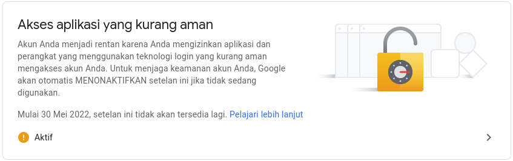

## PHPMailer

PHPMailer adalah pustaka kode untuk mengirim email dengan aman dan mudah melalui kode PHP dari server web. Mengirim email secara langsung dengan kode PHP memerlukan pemahaman tingkat tinggi terhadap standar protokol SMTP dan masalah terkait serta kerentanan tentang Injeksi email untuk pengiriman spam.

### Step 1 
- Installation PHPMailer
```bash
composer require phpmailer/phpmailer
```
### Step 2 
- Turn On Less Secure Apps
- Buka halaman [settingan Less secure apps](https://www.google.com/settings/security/lesssecureapps) dan aktifkan seperti gambar dibawah ini.




### Step 3
- Aktifkan Extension missing: openssl pada file php.ini.
```
;extension=php_openssl.dll
```
Ubaha menjadi seperti dibawah ini:
```
extension=php_openssl.dll
```
setelah itu silahkan restart apache anda dan coba lagi.

### Step 4
- Konfigurasi PHPMailer
```php
use PHPMailer\PHPMailer\PHPMailer;
use PHPMailer\PHPMailer\Exception;

require 'path/to/PHPMailer/src/Exception.php';
require 'path/to/PHPMailer/src/PHPMailer.php';
require 'path/to/PHPMailer/src/SMTP.php';

$mail = new PHPMailer();
$mail->isSMTP();
$mail->SMTPDebug = 0;
$mail->Host = 'smtp.gmail.com';
$mail->Port = 587;
$mail->SMTPSecure = 'tls';
$mail->SMTPAuth = true;
$mail->Username = 'example@gmail.com';
$mail->Password = '********';
$mail->setFrom('example@gmail.com', 'isikan_name');
$mail->addAddress('example@gmail.com', 'isikan_name');
$mail->isHTML(true);    

$mail->Subject = 'Kirim Email via SMTP Server di PHP menggunakan PHPMailer';
// Konten/isi email
$mailContent = "<h1>Mengirim Email HTML menggunakan SMTP di PHP</h1>
    <p><a href='https://github.com/prayogaekaardiansyah'>Github</a></p>";

$mail->Body = $mailContent;
// Kirim email
if(!$mail->send()){
    echo 'Pesan tidak dapat dikirim.';
    echo 'Mailer Error: ' . $mail->ErrorInfo;
}else{
    echo 'Pesan telah terkirim';
}
```
- Untuk melihat Debug Code ubah
```php
$mail->SMTPDebug = 0; //1 - 2 -3 - 4
```